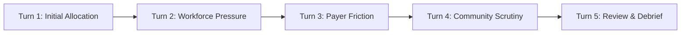

# How to Play Vital Margin (CLI & Core Mechanics)

[Documentation Home](../index.md) | [Installation Guide](installation.md) | [GUI Guide](gui-how-to-play.md) | [Strategy & Mechanics](strategy-and-mechanics.md) | [Glossary](../reference/glossary.md)

---

## 🏥 Welcome to Executive Leadership

In **Vital Margin**, you are the Chief Executive Officer (CEO) of a fictional
nonprofit health system in the United States. Your goal is to guide your
institution through complex operational, clinical, regulatory, and competitive
challenges while keeping your organization financially solvent and true to its
charitable community mission.

The game is **deterministic**: for the same random seed and choices, the engine
produces the exact same outcome. Crucially, the game separates **true engine
state** from **actor-visible observations**—you make choices based on executive
reports and public intelligence, while rivals act simultaneously behind the fog
of market uncertainty.

---

## 🚀 Quick Launch: Playing in the Terminal

1. **Launch the Reference CLI**:
   ```bash
   cargo run
   ```
2. **Select Campaign**:
   - Press **`1`** (or Enter) for **Stabilization Tutorial** (`stabilization-v1`).
   - Press **`2`** (or `c`) for **Competitive Regional Market** (`competitive-regional-v1`).
   - Press **`3`** (or `a`) for **Regional Affiliation** (`regional-affiliation-v1`).
3. **Accept Seed `42`** and select Beginner Guided mode (**`b`**) for a friendly
   first walkthrough.

> [!TIP]
> If you prefer a visual interface with maps, cards, and interactive sliders,
> run `cargo run --bin vital-margin-gui` and open `http://127.0.0.1:7878`. See
> the [GUI Guide](gui-how-to-play.md) for details.

---

## 🎮 Campaign Overview & Structure

Vital Margin offers three standalone campaigns designed for different learning
goals:

| Campaign | Structure | Key Mechanics | Recommended Audience |
| --- | --- | --- | --- |
| **Stabilization Tutorial** (`stabilization-v1`) | 5 abstract executive turns; no calendar clock. | Step-by-step guided prompt on capital spend, staffing relief, rate asks, and access pledges. | All first-time players. |
| **Competitive Regional Market** (`competitive-regional-v1`) | 24 simulated monthly turns. | Action Point (AP) budgeting, simultaneous AI rivals, lagged public signals, multi-month capital projects. | Players ready for deep strategic planning. |
| **Regional Affiliation** (`regional-affiliation-v1`) | 6 sequential institutional stages. | Assessment, posture (pursue/defer/independent), commitments, regulatory review, and integration models. | Players interested in healthcare M&A and governance. |

---

## 1. Stabilization Tutorial (`stabilization-v1`)

The tutorial is a 5-turn structured scenario that introduces the core tradeoffs
of health system leadership:



### Turn Structure
For each turn in the CLI:
1. **Read Briefing & Observation:** Review current cash runway, bed occupancy,
   workforce vacancy rates, and market signals.
2. **Review Uncertainty Range:** View potential stochastic bounds.
3. **Input Numeric Fields:** Enter the prompted values (e.g., `staffed_beds`,
   `capital_spend`, `requested_rate`, `access_commitment`).
4. **Accept Defaults with Enter:** If unsure, press Enter to accept the
   recommended safe baseline.
5. **Inspect Transition Resolution:** Observe how labor unions, commercial
   payers, and community coalitions react.
6. **End-of-Run Debrief:** Receive a full replay verification and causal
   explanation of your performance.

---

## 2. Competitive Regional Market (`competitive-regional-v1`)

In this 24-month campaign, you lead your health system against autonomous AI
rivals (**Summit Health**, **Northlake Regional**, **Valley Memorial**, and
**Metro Health**).

### Difficulty Tiers & Action Point (AP) Budgets
Every month you receive an **Action Point (AP)** budget that represents
executive attention and bandwidth:

| Difficulty Tier | Active AI Rivals | Monthly AP Budget | Strategic Environment |
| --- | --- | --- | --- |
| **Easy** | 1 Rival (Summit Health) | **4 AP / month** | Ample management attention; low rival aggression. |
| **Normal** | 2 Rivals (Summit + Northlake) | **3 AP / month** | Balanced regional competition. |
| **Hard** | 3 Rivals (+ Valley Memorial) | **3 AP / month** | Tight market; rivals aggressively contest market share. |
| **Expert** | 4 Rivals (+ Metro Health) | **2 AP / month** | Constrained executive bandwidth; high rival pressure. |

---

## ⌨️ Competitive Command Reference

Commands use a clean, Stata-like `verb arg=value` syntax. You can chain multiple
commands in a single monthly batch separated by semicolons (`;`).

```text
monitor target=northlake depth=1; recruit role=nurse headcount=4
```

### Complete Command Catalog

| Verb | Syntax | AP Cost | Resource Draw | Description |
| --- | --- | --- | --- | --- |
| **`hold`** | `hold` | **0 AP** | None | Preserves resources and takes no action this month. |
| **`invest`** | `invest domain=<domain> amount=<1..40>` | **1 AP** | $1M per amount | Deploys capital to a specific clinical service line. |
| **`recruit`** | `recruit role=<role> headcount=<1..10>` | **1 AP** | Immediate hiring cost | Hires clinical or administrative staff; arrives after a 1-month onboarding delay. |
| **`monitor`** | `monitor target=<target> depth=<1..3>` | **1 AP** | None | Gathers public and operational intelligence on a rival health system. |
| **`negotiate`** | `negotiate payer=<payer> rate_posture=<posture>` | **1 AP** | Consumes Political Capital | Negotiates reimbursement rates with commercial or public payers. |
| **`commit`** | `commit pledge_type=<type> level=<1..5>` | **1 AP** | Consumes Political Capital | Makes public institutional commitments for community access, clinical quality, or workforce. |
| **`project`** | `project kind=<kind> budget=<amount>` | **2–3 AP** | Amortized monthly cash draw | Commences a large multi-month capital construction project (max 2 active projects). |

### Valid Parameter Values

- **`domain` (for `invest`):**
  `beds`, `outpatient`, `technology`, `emergency`, `icu`, `obstetrics`,
  `psychiatric`, `cardiology`, `oncology`, `infusion`, `neurology`, `asc`
- **`role` (for `recruit`):**
  `nurse` (bedside RNs), `physician` (MD/DO specialists), `admin` (billing/ops)
- **`target` (for `monitor`):**
  `northlake`, `summit`, `valley`, `metro`
- **`depth` (for `monitor`):**
  `1` (basic public filings), `2` (service-line intelligence), `3` (deep posture & payer targets)
- **`payer` (for `negotiate`):**
  `carrier_a`, `carrier_b`, `medicaid`, `medicare`
- **`rate_posture` (for `negotiate`):**
  `aggressive` (high rate increase ask), `neutral` (inflation rate update), `conservative` (defensive rate concessions)
- **`pledge_type` (for `commit`):**
  `access` (charity care & clinic availability), `quality` (clinical safety standards), `workforce` (staffing ratios & support)
- **`kind` (for `project`):**
  - `ehr_epic` (12 months, 2 AP, modern EHR)
  - `ehr_cerner` (12 months, 2 AP, alternative EHR)
  - `tower` (12 months, 2 AP, patient bed tower)
  - `clinic_network` (9 months, 2 AP, primary care clinics)
  - `emergency_pavilion` (6 months, 2 AP, emergency department expansion)
  - `icu_wing` (12 months, 3 AP, intensive care unit)
  - `obstetrics_unit` (9 months, 2 AP, labor & delivery suites)
  - `psychiatric_unit` (6 months, 2 AP, inpatient behavioral health)
  - `cardiology_unit` (6 months, 2 AP, cardiac catheterization & care)
  - `oncology_unit` (9 months, 3 AP, cancer treatment wing)
  - `infusion_center` (6 months, 2 AP, outpatient chemotherapy & infusion)
  - `neurology_unit` (6 months, 2 AP, stroke & neuro care)
  - `asc_unit` (6 months, 2 AP, ambulatory surgical center)

---

## 3. Regional Affiliation (`regional-affiliation-v1`)

This campaign models the evaluation of a potential merger or strategic
partnership with an independent community hospital across 6 discrete stages:

1. **Stage 1: Partner Assessment (`assess`):** Inspect partner clinical quality,
   payer mix, debt load, and cultural alignment.
2. **Stage 2: Strategic Posture (`posture`):** Choose whether to `pursue` a
   formal partnership, `defer` pending further due diligence, or remain
   `independent`.
3. **Stage 3: Commitments & Governance (`commit`):** Define legally binding
   promises regarding charity care levels, service preservation (e.g., keeping
   rural maternity open), and workforce protections.
4. **Stage 4: Regulatory & Community Review (`submit_review`):** Submit the
   proposed transaction to state health department regulators and public
   hearings.
5. **Stage 5: Review Resolution & Integration (`integrate`):** Choose the
   operational model: Full Asset Merger, Clinical Service Line Integration,
   Loose Affiliation, or Mutual Termination.
6. **Stage 6: Operational Debrief:** Review financial outcomes, workforce
   morale, and community access consequences.

---

## 💡 Practical Beginner Walkthrough

### Example Scenario: Month 2 in Competitive Regional Market (Normal Difficulty)

**Your Monthly Executive Briefing Shows:**
- Cash Runway: `watch` (5.2 months).
- Nurse Vacancy: 14% (rising due to regional nurse shortage).
- Intelligence Signal: Rival Summit Health filed permits for an outpatient
  surgical center.
- Monthly Budget: 3 AP available, $60M cash on hand.

**Your Decision Batch:**
```text
monitor target=summit depth=1; recruit role=nurse headcount=4
```

**Why this is a strong plan:**
1. `monitor target=summit depth=1` (1 AP): Gathers exact intelligence on
   Summit's project timeline so you can decide next month whether to counter
   with your own Ambulatory Surgical Center (`asc_unit`).
2. `recruit role=nurse headcount=4` (1 AP): Stabilizes the nursing vacancy rate
   before staffing deficits trigger turnover penalties.
3. You spent 2 AP out of 3 AP and preserved remaining cash, keeping flexibility
   open for Month 3.

---

## ❓ Frequently Asked Questions (FAQ)

### Q: I entered a command and received a syntax error. Did I waste my turn?
**A:** No! Validation errors do not advance the simulation. The host reports the
exact error and lets you re-enter a valid command batch.

### Q: Why did a sound decision still result in a margin drop?
**A:** Regional epidemics, macro policy adjustments, and simultaneous rival
actions create stochastic friction. Review the **Review Debrief** to evaluate
your *Decision Quality* separately from *Outcome Quality*.

### Q: How do I exit or save my session?
**A:** Type `q`, `quit`, or `exit` in the CLI. The host automatically maintains
immutable history and saves checkpoints.

---

## 📖 Related Guides

- [How to Play in GUI Mode](gui-how-to-play.md)
- [Comprehensive Strategy & Mechanics Guide](strategy-and-mechanics.md)
- [Glossary of Key Terms](../reference/glossary.md)
- [Installation Guide](installation.md)
