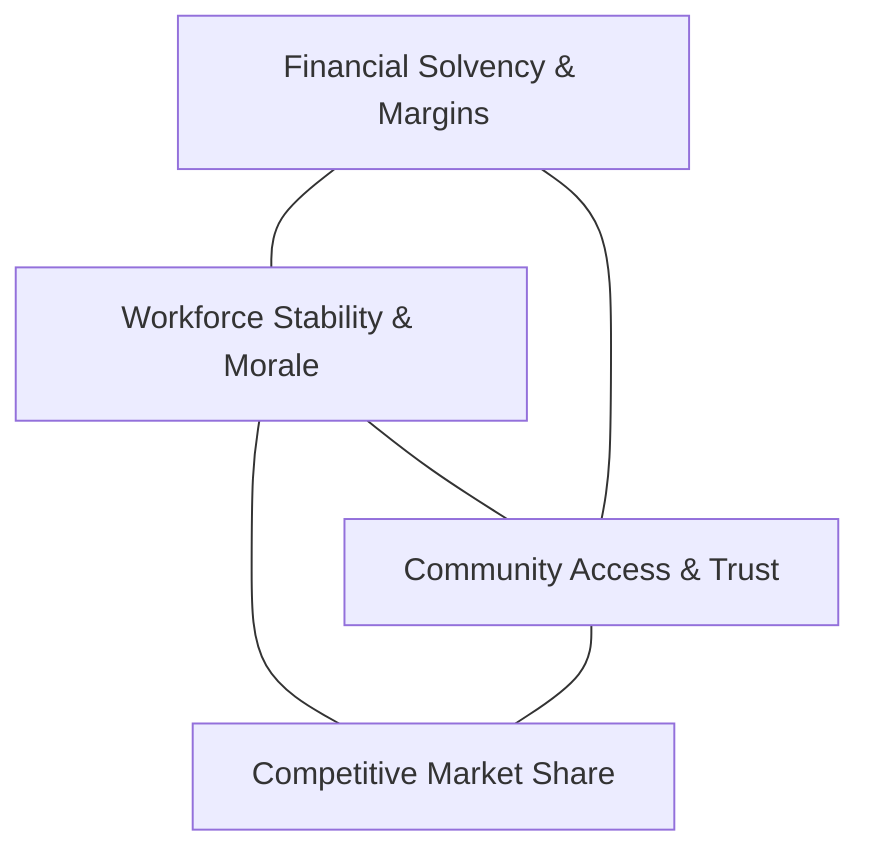

# Strategy & Mechanics Guide

[Documentation Home](../index.md) | [Installation Guide](installation.md) | [GUI Guide](gui-how-to-play.md) | [CLI Guide](how-to-play.md) | [Glossary](../reference/glossary.md)

---

This guide provides an in-depth strategic framework for leading your health
system across the **Competitive Regional Market** (`competitive-regional-v1`),
**Stabilization Tutorial** (`stabilization-v1`), and **Regional Affiliation**
(`regional-affiliation-v1`) campaigns.

---

## 🎯 The Executive Dilemma

In Vital Margin, you cannot optimize a single metric in isolation. Real-world
health systems operate under the constant friction of competing institutional
goals:



- **Increasing margins** via aggressive commercial rate demands can trigger
  payer network exclusions and public scrutiny.
- **Expanding community access** without adding staffed beds creates severe
  staff burnout, emergency department overcrowding, and surging nurse
  turnover.
- **Aggressive capital expansion** drains liquid cash reserves, leaving your
  system vulnerable to unexpected regional volume shocks.

---

## 🏛️ The Five Core Operational Pillars

### 1. Financial Solvency & Capital Budgeting

Your health system operates on cash reserves, operating margins, and credit
capacity.

#### Cash Runway Status
The executive briefing reports cash runway in four distinct status bands:
- **`comfortable` (9+ months of operating burn):** You have ample liquidity to
  fund capital projects, staff recruitment, and strategic initiatives.
- **`watch` (4–8 months):** Cash burn is elevated. Avoid initiating multiple
  large capital projects simultaneously.
- **`strained` (2–3 months):** Immediate risk of liquidity crisis. You must
  pause discretionary capital investments and prioritize cash preservation.
- **`critical` (<2 months):** Urgent insolvency danger. Restrict all actions to
  essential operations and cash-neutral holds.

#### Capital Project Catalog
Capital projects expand durable institutional capabilities but require monthly
cash outlays across their construction duration:

| Project (`kind`) | Total Budget | Duration | Monthly Cost | Strategic Impact |
| --- | --- | --- | --- | --- |
| `ehr_epic` | $60M | 3 months | $20M/mo | Modernizes electronic health records, boosting billing capture and cross-department efficiency. |
| `cardiac_tower` | $120M | 6 months | $20M/mo | Adds high-margin tertiary cardiac surgery capacity and inpatient beds. |
| `asc_unit` | $30M | 2 months | $15M/mo | Ambulatory Surgical Center: captures high-margin outpatient procedures before rivals. |
| `urgent_care` | $20M | 2 months | $10M/mo | Expands community outpatient access and diverts low-acuity volume from overcrowded EDs. |
| `cancer_center` | $80M | 4 months | $20M/mo | Comprehensive oncology infusion and surgical center; strong regional market draw. |
| `wellness_center` | $10M | 1 month | $10M/mo | Community preventive care hub; builds strong public legitimacy and trust. |

> [!IMPORTANT]
> **Project Limit Rule:** You may have at most **2 active capital projects**
> undergoing construction simultaneously. Submitting a third project will be
> rejected during plan validation.

---

### 2. Workforce Dynamics & Staffing Pipelines

Your clinical capacity is determined not just by physical beds, but by the
doctors, nurses, and allied staff available to care for patients.

- **Recruitment Delay:** Staffing pipelines take time to onboard. When you
  execute `recruit role=nurse headcount=5`, cash is committed immediately, but
  the newly staffed capacity arrives with a 1-month delay.
- **Workforce Trust:** Measured from 0% to 100%. Trust falls when overtime is
  excessive, vacancy rates spike, or executive pledges fail to deliver
  workforce relief. High trust boosts retention; low trust accelerates
  costly nurse turnover and contract labor spend.
- **Staffing Deficit Penalties:** Operating clinical units without adequate
  nurse-to-patient ratios triggers severe quality penalties and increases
  malpractice risk.

---

### 3. Commercial & Public Payer Negotiations

Revenue depends heavily on your negotiated reimbursement rates with health
insurers:

```
[ Payer Mix: Commercial (Carrier A, Carrier B) | Medicare (Public) | Medicaid (Public) ]
```

- **Commercial Insurers (`carrier_a`, `carrier_b`):**
  - `rate_posture=aggressive`: Requests substantial rate increases (+5% to +15%).
    Requires market leverage (high quality, indispensable specialty services).
    Risk: Payer may threaten network exclusion or steer patients to rivals.
  - `rate_posture=neutral`: Standard market adjustments aligned with medical
    inflation. Safe, stable, and maintains insurer relationships.
  - `rate_posture=defensive`: Accepts lower rate increases in exchange for
    preferred tiered-network placement and volume commitments.
- **Public Payers (`medicare`, `medicaid`):**
  - Rates are administratively fixed by government policy.
  - Standard commands cannot directly raise rates. You must deploy political
    capital (`pc`) through coalition advocacy to protect public reimbursement.

---

### 4. Community Access & Public Legitimacy

As a 501(c)(3) nonprofit health system, your tax-exempt status and community
reputation depend on fulfilling your charitable mission:

- **Public Access Pledges (`commit pledge_type=access level=1..5`):**
  - Pledging higher charity care and subsidized clinic access builds community
    goodwill, lowers political scrutiny, and satisfies board governance.
- **The "Pledge Follow-Through Trap":**
  - *Common beginner mistake:* Repeatedly pledging high access (`level=4` or `5`)
    without expanding clinic beds or hiring nursing staff.
  - *Result:* When vulnerable patients show up to clinics that lack capacity,
    unmet demand surges, wait times skyrocket, and the end-of-run debrief notes
    a severe failure of operational follow-through.

---

### 5. Market Intelligence & Rival Dynamics

In competitive campaigns, you face up to 4 autonomous AI health systems
operating in the same region:

| Rival Health System | Typical Strategy Profile | Key Vulnerability |
| --- | --- | --- |
| **Summit Health** | Aggressive suburban outpatient and surgical expansion. | High debt load and sensitive to commercial payer rate pushback. |
| **Northlake Regional** | High-cost academic medical center; dominates complex tertiary care. | High fixed cost structure and slow to adapt to outpatient shifts. |
| **Valley Memorial** | Community-focused safety-net system; high Medicaid share. | Vulnerable to staffing shortages and cash flow crunches. |
| **Metro Health** | Commercial network focused on low-cost ambulatory centers. | Lower clinical reputation in complex inpatient care. |

- **Simultaneous Action Resolution:** Rivals formulate their plans at the exact
  same time as you. If both you and Summit Health build an ASC in Month 4,
  regional surgical capacity doubles, diluting patient volume for both.
- **Monitoring (`monitor target=<name> depth=1..3`):**
  - `depth=1`: Basic financial health and announced public capital projects.
  - `depth=2`: Detailed service-line utilization and physician hiring moves.
  - `depth=3`: Deep strategic posture and private payer negotiation targets.

---

## 🧭 Four Tested Strategic Archetypes

Experiment with these four proven strategic postures:

### Archetype A: The Fiscal Turnaround
- **Philosophy:** "Fix the balance sheet before expanding the empire."
- **Month 1–6 Focus:** Run `hold` or light `recruit`, reject new capital
  projects, build cash runway to `comfortable`, and negotiate stable `neutral`
  rates.
- **When to Use:** When starting with low cash reserves or high existing debt.

### Archetype B: Outpatient & Ambulatory Growth
- **Philosophy:** "Capture surgical volume outside the expensive hospital
  walls."
- **Month 1–8 Focus:** Build `asc_unit` and `urgent_care` early. Recruit
  physicians and specialized nurses. Monitor Summit Health closely.
- **When to Use:** When regional demand for elective outpatient procedures is
  booming.

### Archetype C: Workforce Resilience & High Quality
- **Philosophy:** "A supported clinical staff drives clinical excellence and
  efficiency."
- **Month 1–12 Focus:** Consistent nurse recruiting, schedule relief
  investments, and maintaining 80%+ workforce trust.
- **When to Use:** When nurse vacancy is elevated and burnout threatens
  operational throughput.

### Archetype D: Regional Market Anchor
- **Philosophy:** "Become the indispensable tertiary center for the entire
  region."
- **Month 1–18 Focus:** Construct the `cardiac_tower` or `cancer_center`,
  secure aggressive commercial rates through clinical leverage, and balance
  high-margin care with strong community charity access.

---

## 🚨 Emergency Triage Playbook

Use these decision trees when facing operational crises:

### Situation 1: Cash Runway is `strained` or `critical`
1. ❌ **Immediately stop all new capital projects (`project`).**
2. ❌ **Do not spend maximum AP on cash-intensive investments (`invest`).**
3. 🔍 Check upcoming monthly commitments in the **Pending processes** rail.
4. ✅ Submit `hold` or low-cost `recruit` to let operating cash flow recover.
5. 📊 In your next commercial payer renewal, accept a `defensive` or `neutral`
   posture to lock in reliable patient volume.

### Situation 2: Nursing Vacancy Exceeds 20%
1. 👥 Submit `recruit role=nurse headcount=4` or `5` immediately.
2. 🛡️ Submit `commit pledge_type=workforce level=3` to reassure internal
   clinical staff.
3. ⏸️ Delay opening new physical beds until existing units are safely staffed.
4. 🩺 Monitor workforce trust in the Brief dashboard next month to confirm
   turnover is stabilizing.

### Situation 3: Rival is Encroaching on Your Primary Service Area
1. 📡 Submit `monitor target=<rival> depth=2` to discover their intended
   service line.
2. 🏥 If they are opening an Urgent Care clinic nearby, counter with an
   ambulatory surgical center (`asc_unit`) or specialized outpatient clinic
   (`invest domain=outpatient amount=20`).
3. 🤝 Partner with local primary care physician networks to protect referral
   streams.

---

## 🎓 Mastering the Debrief

At the conclusion of each campaign (or in the Review workspace), Vital Margin
generates a comprehensive causal debrief.

| Metric Evaluation | Score / Classification | Key Causal Drivers |
| :--- | :--- | :--- |
| **Decision Quality** | **HIGH (88%)** | • Maintained healthy 6.2-month cash runway throughout all 24 months.<br>• Successfully contained nurse vacancy below 8% through steady recruiting.<br>• Backed public access commitments with $45M in durable community clinic capacity. |
| **Outcome Quality** | **MODERATE (72%)** | • Outpatient procedure margin compressed due to simultaneous rival ASC market entry in Month 8.<br>• Commercial payer pushback during annual contract renewal. |

### Key Lesson: Decision Quality vs. Outcome Quality
- **Decision Quality:** Evaluates whether your moves were logical, timely, and
  resource-efficient given *the information visible to you at the time of the
  choice*.
- **Outcome Quality:** Reflects the actual end state after accounting for
  unpredictable rival moves, macroeconomic shifts, and stochastic friction.
- **The Takeaway:** Do not abandon a sound strategic process just because one
  stochastic shock caused a temporary margin dip. True leadership mastery lies
  in maintaining consistent decision quality across multiple runs!
