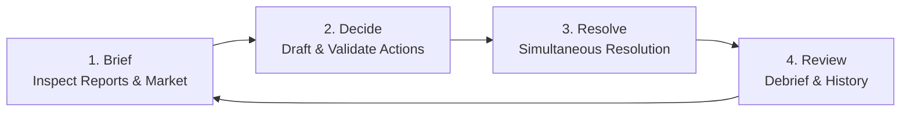

# Vital Margin Documentation Portal

Welcome to the player manual, strategic guides, and technical reference for
**Vital Margin**, a deterministic health-policy strategy game developed in
Rust.

In Vital Margin, you step into the role of a newly appointed Chief Executive
Officer (CEO) leading a fictional nonprofit US health system. Your challenge is
to balance competing institutional imperatives: maintaining financial
solvency, sustaining a dedicated clinical workforce, preserving community trust
and public access, negotiating with commercial and public payers, and
navigating aggressive regional competitors.

---

## ⚡ Quickstart: Play in 60 Seconds

Vital Margin runs locally on your machine without requiring external servers,
cloud accounts, or databases.

1. **Install Rust and Cargo** from [rustup.rs](https://rustup.rs) (or see the
   [Installation Guide](guides/installation.md)).
2. **Launch the Live GUI**:
   ```bash
   cargo run --bin vital-margin-gui
   ```
3. Open your browser to the printed loopback address (typically
   `http://127.0.0.1:7878`).
4. Select **Stabilization tutorial** (`stabilization-v1`), accept seed `42`, and
   click **Start selected session**!

Prefer the terminal? Run `cargo run`, select `1` for stabilization, choose
beginner guided mode (`b`), and press Enter.

---

## 📚 Player Manuals & Guides Directory

Explore our player-facing guides designed for both first-time players and
experienced strategists:

| Guide | Description | Target Audience |
| --- | --- | --- |
| 🚀 **[Installation & First Launch](guides/installation.md)** | Step-by-step setup for macOS, Windows (PowerShell), and Linux, including Cargo verification, ZIP vs Git workflows, and troubleshooting. | Everyone / New Players |
| 🖥️ **[How to Play in GUI Mode](guides/gui-how-to-play.md)** | Comprehensive manual for the browser interface: Brief, Decide, Resolve, and Review workspaces, action drafting, saved checkpoints, accessibility, and audio. | GUI Players |
| ⌨️ **[How to Play in the CLI](guides/how-to-play.md)** | Complete guide to the reference terminal interface, interactive prompts, and full competitive command syntax cheat sheet. | CLI / Power Users |
| 🧠 **[Strategy & Mechanics Guide](guides/strategy-and-mechanics.md)** | Deep dive into the action economy, cash runway triage, workforce trust, rate negotiations, rival monitoring, and debrief analysis. | Intermediate & Advanced |
| 📖 **[Glossary & Terminology](reference/glossary.md)** | Clear definitions for all simulation concepts, economic metrics, actor roles, and game terminology. | All Players & Reviewers |
| 🤖 **[MCP & AI Agent Playtesting Guide](guides/mcp-playtesting-guide.md)** | Operational guide for running automated AI playtests, strategy diagnostics, and Model Context Protocol (MCP) integrations. | Developers & Researchers |

---

## 🎮 The Three Campaigns

Vital Margin features three distinct, standalone campaigns. Progress and
checkpoints do not transfer between them:

```
+---------------------------------------------------------------------------------------------------+
|                                       VITAL MARGIN CAMPAIGNS                                      |
+---------------------------------+---------------------------------+-------------------------------+
|     STABILIZATION TUTORIAL      |   COMPETITIVE REGIONAL MARKET   |      REGIONAL AFFILIATION     |
|       (stabilization-v1)        |    (competitive-regional-v1)    |   (regional-affiliation-v1)   |
+---------------------------------+---------------------------------+-------------------------------+
| - 5 abstract executive decisions| - 24 monthly decision turns     | - 6 institutional stages      |
| - Guided first-run experience   | - Simultaneous AI rivals        | - Nonprofit merger/partner    |
| - Teaches core tradeoffs        | - Monthly Action Points (AP)    | - Board & regulatory review   |
| - Recommended first session     | - 4 Difficulty tiers            | - Commitments vs independence |
+---------------------------------+---------------------------------+-------------------------------+
```

### 1. Stabilization Tutorial (`stabilization-v1`)
- **Length:** 5 abstract executive decisions (no calendar clock).
- **Focus:** Learning how capital spend, staffing relief, rate postures, and
  community access commitments interact.
- **Difficulty:** Fixed tutorial parameters (no difficulty setting).
- **Recommendation:** **Start here!** This is the ideal sandbox for learning the
  game's rules and cause-and-effect structure.

### 2. Competitive Regional Market (`competitive-regional-v1`)
- **Length:** 24 simulated months.
- **Focus:** Multi-year strategic competition against local AI health systems
  (Summit Health, Northlake Regional, Valley Memorial, Metro Health).
- **Mechanics:** Monthly Action Point (AP) budgets, simultaneous multi-actor
  turn resolution, lagged public market intelligence, large capital projects
  (e.g., Cardiac Tower, Ambulatory Surgical Center), and staffing pipelines.
- **Difficulty Tiers:**
  - *Easy:* 1 rival, 4 AP / month.
  - *Normal:* 2 rivals, 3 AP / month.
  - *Hard:* 3 rivals, 3 AP / month.
  - *Expert:* 4 rivals, 2 AP / month.

### 3. Regional Affiliation (`regional-affiliation-v1`)
- **Length:** 6 structured stages.
- **Focus:** High-stakes nonprofit strategic partnership and merger
  evaluation.
- **Stages:** Partner Assessment → Strategic Posture → Governance & Public
  Commitments → Regulatory/Community Review → Integration Approach → Operational
  Debrief.
- **Mechanics:** Bounded stage-specific decisions balancing institutional
  autonomy, financial stability, workforce protection, and clinical continuity.

---

## 🔄 The Core Gameplay Loop

Vital Margin operates on a 4-phase loop that mirrors real-world executive
governance:



1. **Brief:** Inspect your monthly executive dashboard—cash runway, operating
   margins, bed occupancy, nurse/physician vacancies, payer mix, and public
   intelligence signals on rival activities.
2. **Decide:** Draft actions within your monthly Action Point (AP) and budget
   limits. Validate your plan with the host before committing.
3. **Resolve:** Commit your decisions. The engine deterministically resolves
   your actions alongside NPC responses and rival moves.
4. **Review:** Inspect the attribution ledger to see exactly what changed, what
   remains uncertain, and review the end-of-run causal debrief.

---

## 💡 Core Design Principles

- **Deterministic Simulation:** For any given random seed and sequence of
  choices, the simulation is 100% reproducible.
- **True State vs. Actor Observations:** You only see what an executive in your
  position would legitimately observe. Rivals make independent choices behind
  the fog of lagged public reporting.
- **Decision Quality vs. Outcome Quality:** A sound strategic decision can still
  face unfavorable stochastic friction (e.g., unexpected regional epidemics or
  rival price wars). The game's post-run debrief evaluates your *decision
  quality* based on information available at decision time.
- **Action Economy & Opportunity Cost:** You cannot solve every problem in a
  single month. Choosing to expand outpatient clinics means postponing a bed
  renovation or workforce retention bonus.

---

## 🛠️ Contributor & Technical Resources

Looking under the hood or contributing to Vital Margin? Check out our technical
documentation:

- [Contributor Documentation Index](README.md)
- [Project Specification (SPEC)](../SPEC.md)
- [System Architecture](../ARCHITECTURE.md)
- [Project Proposal](proposal.md)
- [Development Roadmap](roadmap.md)
- [Design Principles](design_principles.md)
- [Asset Licensing & Provenance](reference/asset-licensing-policy.md)

---

## ⚠️ Educational & Scope Notice

Vital Margin is a fictional educational simulation and research prototype. Game
units, metrics, and dynamics are simplified strategic abstractions designed to
teach institutional decision-making under uncertainty. It is not an empirical
forecasting tool, financial calculator, clinical guideline, or legal/antitrust
advisory instrument.
